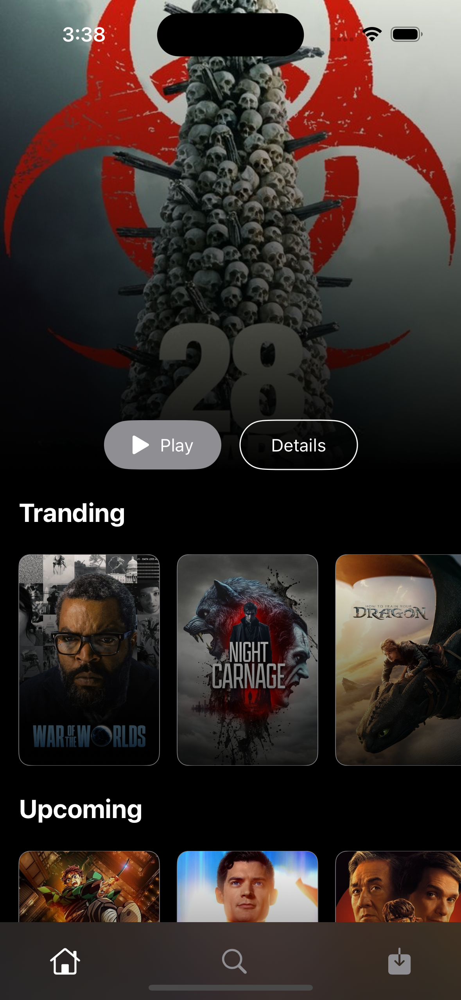
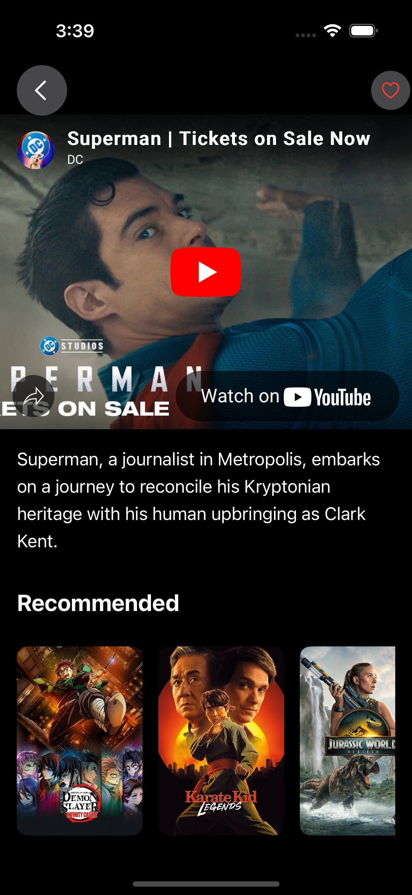
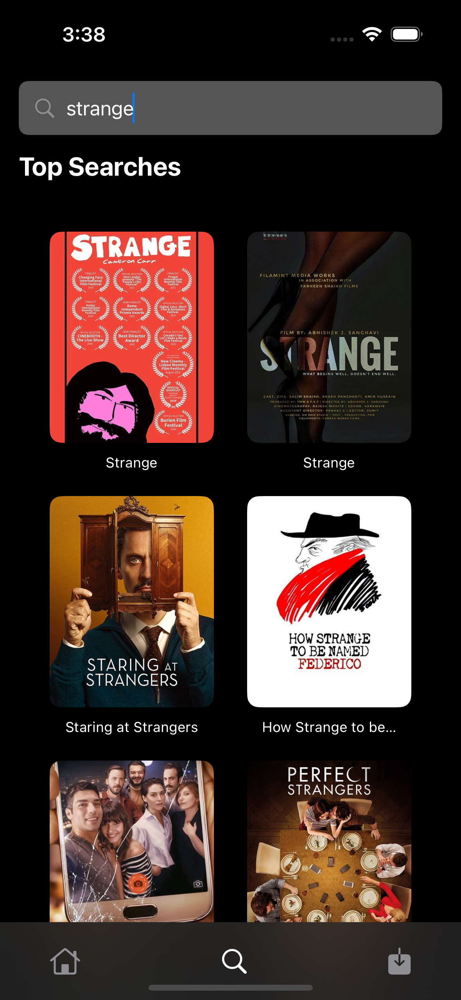

# 🎬 MovieMate

MovieMate is a Netflix-style iOS app built with **SwiftUI** and **Combine**, powered by the **TMDB API**.  
It allows users to browse trending and popular movies, watch trailers, search with debouncing, and add favorites.

---

## ✨ Features
- **Home Screen**: Trending & Popular movies in Netflix-like sections.
- **Movie Detail View**: Watch YouTube trailers with WebView integration.
- **Search with Debouncing**: Smooth, real-time search powered by Combine.
- **Favorites**: Save and manage your favorite movies.
- **Native SwiftUI Design**: Clean, responsive, and dark-themed like Netflix.

---

## 📸 Screenshots

<p align="center">
  
  
  
</p>

---

## 🛠 Tech Stack
- **SwiftUI** for UI
- **Combine** for reactive programming and debouncing
- **TMDB API** for movie data
- **WebKit** for trailer playback
- **EnvironmentObject** for shared state (Favorites)

---

## 🚀 Getting Started

### 1. Clone the repository
```bash
git clone https://github.com/deepakmaurya9648/MovieMate.git
